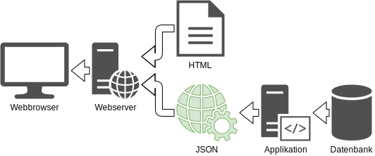

:data-transition-duration: 2000
:skip-help: true
:css: css/campus02.css

.. role:: html(code)
  :language: html

.. title: Representational state transfer

----

REST
====

Representational state transfer

*(für HTTP)*

----

Agenda
======

* Grundlagen
* Prinzipien
* Umsetzung für HTTP
* Webservices
* Authentifizierung

----

Grundlagen
----------

* Ist ein Programmierparadigma.
* Kann mit verschiedenen Mechanismen implementiert werden.
* Umfassender Gebrauch von HTTP-Features.
* Nutzt URIs als Identifizierungsmechanismus für Ressourcen.
* Fördert Verwendung von "*Clean URLs*"

----

Prinzipien
----------

**Sechs** Eigenschaften legen fest, ob ein Service dem REST-Paradigma entspricht. Es
ist nicht festgelegt, wie diese implementiert sein müssen.

----

1: Client-Server
----------------

* Der Server wartet auf Anfragen.
* Ein oder mehrere Clients fragen Service ab.
* Unterstützt die Entkoppelung der Datenhaltung vom Benutzerinterface.

----

Traditionelle Kopplung
----------------------

* Einbettung der Daten/Ressource direkt in HTML durch Anwendung am Webserver (z.B.
  durch Templatingsystem).
* Daten werden zusammen mit ihrer grafischen Oberfläche (HTML) übertragen.

----

Lose Bindung mit REST
---------------------

* Grafische Oberfläche wird mit HTML übertragen.
* Enthält Code zum Einbetten von Daten, jedoch nur Platzhalter.
* Platzhalter werden bei Bedarf mit Daten aus der REST-API befüllt.

----

2: Zustandslosigkeit
--------------------

* Jede REST-Nachricht enthält alle Informationen, die für den Server bzw. Client
  notwendig sind, um die Nachricht zu verstehen.
* Der Server speichert keine Zustandsinformationen.
* Begünstigt Skalierbarkeit von Webservices.
* Client speichert optional Zustandsinformationen (Cookies).

----

3: Caching
----------

* Nutzt **HTTP-Caching**.
* Eine Anfrage, die nicht gestellt werden muss, ist die schnellste Anfrage.

----

4: Einheitliche Schnittstelle
-----------------------------

* Repräsentationen zur Veränderung von Ressourcen.
* Adressierbarkeit von Ressourcen.
* Selbstbeschreibende Nachrichten.
* *Hypermedia as the Engine of Application State* (HATEOAS).

----

CRUD
----

Beschreibt die **vier** grundlegenden Operationen der dauerhaften Datenhaltung:

* :code:`Create`: Datensatz anlegen
* :code:`Read` oder :code:`Retrieve`: Datensatz lesen
* :code:`Update`: Datensatz aktualisieren
* :code:`Delete` oder :code:`Destroy`: Datensatz löschen

----

Umsetzung für HTTP
------------------

REST selbst fordert keine spezielle Implementierung oder Protokoll. Im *WWW* kommt
aber fast ausschliesslich **HTTP**/**HTTPS** zum Einsatz.

Jede Operation (*CRUD*) eines Dienstes wird an eine HTTP-Methode gebunden.

----

GET
---

* Fordert eine Ressource vom Server an.
* Weist keine Nebeneffekte auf.
* Ressource am Server wird nicht verändert.
* Wird als sicher bezeichnet.

POST
----

* Fügt neue Ressource unterhalb der angegebenen Ressource ein.
* Als Ergebnis wird der neue Ressourcenlink zurückgegeben.

----

PUT
---

* Die angegebene Ressource wird angelegt.
* Eine bestehende Ressource wird geändert.

PATCH
-----

* Ein Teil der angegebenen Ressource wird geändert.
* Nebeneffekte sind erlaubt.

----

DELETE
------

* Löscht die angegebene Ressource.

HEAD
----

* Fragt ab, ob Ressource existiert.
* Liefert Metadaten zur Ressource zurück.
* Weist keine Nebeneffekte auf.

----

OPTIONS
-------

* Prüft, welche Methoden auf einer Ressource zur Verfügung stehen.
* Weist keine Nebeneffekte auf.

----

Clean URLs
----------

Welche URL lässt am besten Rückschlüsse auf ihren Inhalt zu?

.. code::

  http://de.wikipedia.org/w/index.php?title=Clean_URL
  http://de.wikipedia.org/w/index.php?id=123
  http://de.wikipedia.org/wiki/Clean_URL

----

Adressierbarkeit
----------------

Auf eine Menge von gleichartigen Ressourcen:

**GET /movies/**
  Eine Liste aller Ressourcen eines Typs

**POST /movies/**
  Eine neue Ressource dieses Typs anlegen

----

Adressierbarkeit
----------------

Auf eine einzelne Ressource:

**GET /movies/1/**
  Die Resource mit der ID *1*

**PUT /movies/1/**
  Die Ressource mit der ID *1* mit neuen Daten aktualisieren

**DELETE /movies/1/**
  Die Ressource mit der ID *1* löschen

----

Adressierbarkeit
----------------

Verschachtelung von Ressourcen (optional, muss vom REST-API unterstützt werden):

**GET /movies/1/genres/**
  Eine Liste aller Sub-Ressourcen zur Ressource mit der ID *1*

**GET /movies/1/genres/3/**
  Die Sub-Ressource mit der ID *3* von der Ressource mit der ID *1*

**DELETE /movies/1/genres/3/**
  Die Sub-Ressource mit der ID *3* von der Ressource mit der ID *1* entfernen

Alle Operationen können auch auf Sub-Ressourcen angewandt werden. Der Tiefe der
Verschachtelung ist nicht begrenzt.

----

5: Mehrschichtige Systeme
-------------------------

* Ein Client muss nicht direkt mit dem Server kommunizieren.
* Zwischengeschaltete Server sind möglich:

  * Load-Balancing
  * Shared Caches (Reverse-Proxy)
  * Sicherheitsrichtlinen umsetzen
  * ...

----

6: Code on Demand
-----------------

* Code wird nur bei Bedarf an den Client übertragen.
* Zum Beispiel bei HTML/JavaScript.
* Ist optional.

----

Sicherheit
----------

* Öffentliche Services ohne Authentifizierung möglich.
* Authentifizierung über verschiedene Mechanismen:

  * HTTP Basic Authentication
  * HMAC
  * OAuth(2)
  * OpenID

* Für sensiblen Nachrichteninhalt ist eine Übertragung mittels HTTPS nötig.

----

Hypermedia as the Engine of Application State (HATEOAS)
-------------------------------------------------------

* Entwurfsprinzip von REST-Architekturen.
* Clients navigieren eine REST-Schnittstelle ausschließlich über URLs.
* Ausser der Basis-URL werden alle URLs vom Server bereitgestellt.
* URLs in JSON-Elementen (z.b. Verweise auf andere Ressourcen).
* Gewährleistet lose Bindung (keine Schnittstellenbeschreibung nötig).
